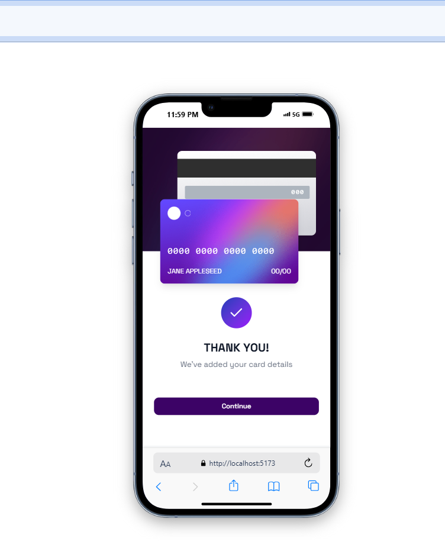
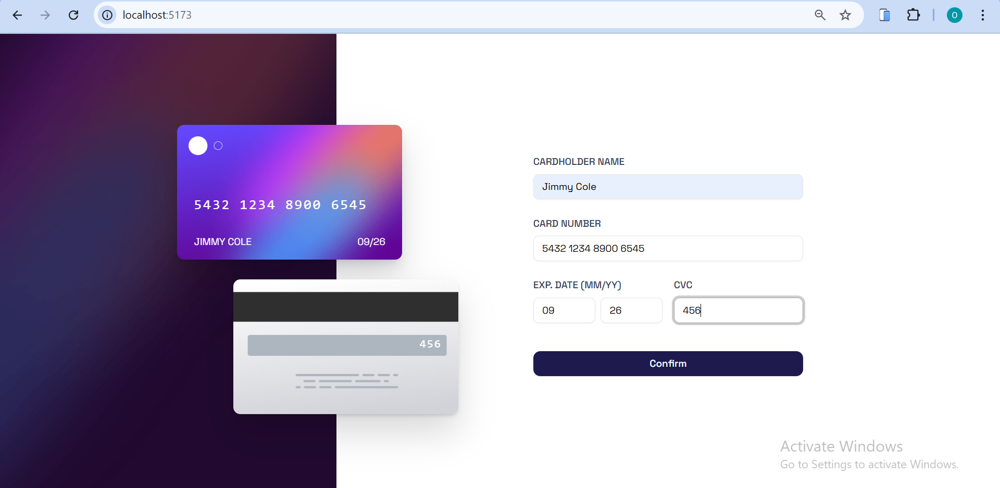
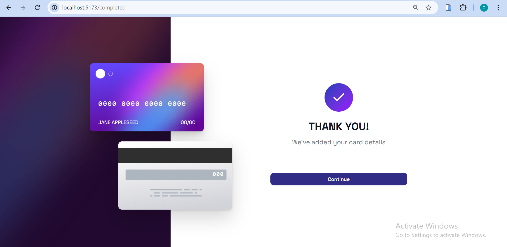

# Frontend Mentor - Interactive card details form solution

This is a solution to the [Interactive card details form challenge on Frontend Mentor](https://www.frontendmentor.io/challenges/interactive-card-details-form-XpS8cKZDWw).  
Frontend Mentor challenges help you improve your coding skills by building realistic projects.

## Table of contents

- [Overview](#overview)
  - [The challenge](#the-challenge)
  - [Screenshot](#screenshot)
  - [Links](#links)
- [My process](#my-process)
  - [Built with](#built-with)
  - [Assets & Project Structure](#assets--project-structure)
  - [What I learned](#what-i-learned)
  - [Continued development](#continued-development)
  - [Useful resources](#useful-resources)
- [Author](#author)
- [Acknowledgement](#acknowledgement)

---

## Overview

### The challenge

An Interactive card details form where Users should be able to:

- Fill in the form and see the card details update in real time (including the card logo)
- Receive error messages when the form is submitted if:
  - Any input field is empty
  - The card number, expiry date, or CVC fields are in the wrong format
- View the optimal layout depending on their device's screen size (mobile and desktop)
- See hover, active, and focus states for interactive elements
- View a success screen upon submission

---

### Screenshot

**Mobile view**

**Desktop view**

**Desktop2 view**

---

### Links

- **Live Site URL:** [Kredit kard Demo](https://kredit-kard.vercel.app/)

---

## My process

### Built with

- Semantic **HTML5** markup
- **CSS custom properties** with Tailwind CSS
- **Flexbox** & **CSS Grid**
- **Mobile-first** responsive workflow
- **React** (functional components & hooks)
- **React Router** for routing and navigation between form and success page
- **Tailwind CSS** for styling
- **PNG** and **SVG** assets for cards, background, and logo
- **Custom form validation** with real-time error feedback

---

### Assets & Project Structure

The project uses PNGs for backgrounds and card mockups, and SVGs for icons/logos.  
Assets are separated into `mobile` and `desktop` versions to match the challenge’s responsive requirements.

src/
│
├── assets/
│ ├── bg-main-mobile.png # Mobile background image
│ ├── bg-main-desktop.png # Desktop background image
│ ├── card-front.png # Card front PNG
│ ├── card-back.png # Card back PNG
│ ├── card-logo.svg # Card logo (SVG)
│ ├── icon-complete.svg # Completed page icon (SVG)
│ └── favicon-32x32.png
│
├── components/
│ ├── CardDisplay.jsx # Shows card front/back with dynamic data
│ ├── CardForm.jsx # Form with validation and live updates
│
├── pages/
│ ├── Home.jsx # Main page with background + card + form
│ └── CompletedPage.jsx # Submission success screen
│
├── styles/
│ └── index.css # Tailwind CSS imports and global styles
│
└── App.jsx # React Router setup

---

### What I learned

This project helped me strengthen my **form handling** and **real-time UI updates** in React.  
I also learned how to work with **image-based card designs** instead of gradients and how to position background assets for perfect alignment across devices.

---

### Continued development

In the future, I want to:

- Integrate **auto-detection of card type** (Visa, MasterCard, etc.) based on number prefix

- Implement a **masked card number autofill experience**

- Add **form data persistence** so progress isn’t lost on refresh

---

### Useful resources

- **Tailwind CSS Docs** – Quick utility lookup for responsive design

- **MDN - HTML Autofill** – Helped me use the correct autocomplete attributes for card fields

- **Frontend Mentor Community** – Inspiration for layout alignment and form validation patterns

---

## Author

- Frontend Mentor – @ibeO-GH

- GitHub – @ibeO-GH

---

## Acknowledgement

Special thanks to **Frontend Mentor** for providing the challenge and design resources,
and to the **developer community** for sharing tips and feedback that helped improve this project.
